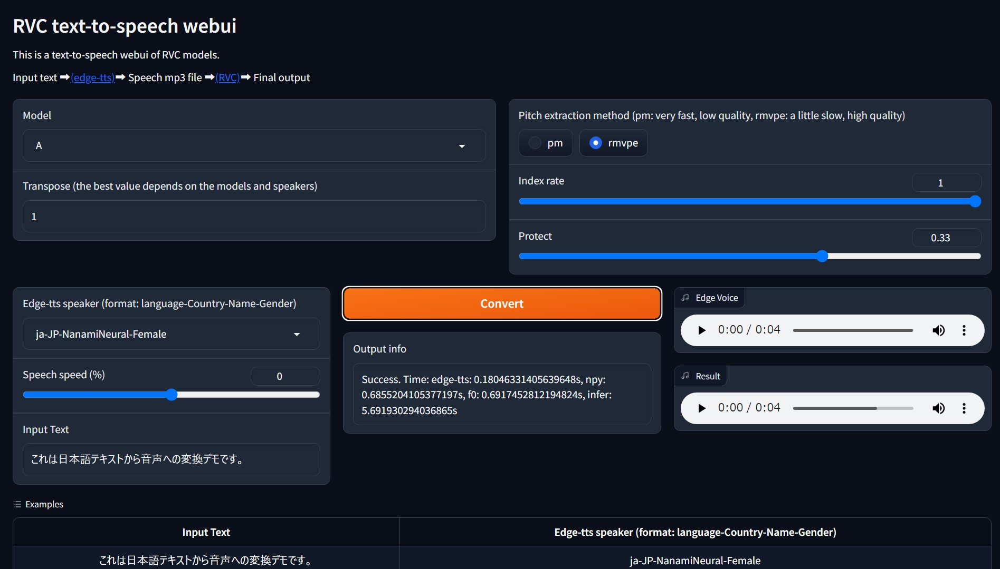

# RVC Text-to-Speech WebUI

This is a text-to-speech Gradio webui for [RVC](https://github.com/RVC-Project/Retrieval-based-Voice-Conversion-WebUI) models, using [edge-tts](https://github.com/rany2/edge-tts).

[🤗 Online Demo](https://huggingface.co/spaces/litagin/rvc_okiba_TTS)

This can run on CPU without GPU (but slow).



## Install

Requirements: Tested for Python 3.10 on Windows 11.

```bash
git clone https://github.com/litagin02/rvc-tts-webui.git
cd rvc-tts-webui

# Download models in root directory
curl -L -O https://huggingface.co/lj1995/VoiceConversionWebUI/resolve/main/hubert_base.pt
curl -L -O https://huggingface.co/lj1995/VoiceConversionWebUI/resolve/main/rmvpe.pt

# Make virtual environment
python -m venv venv
# Activate venv (for Windows)
venv\Scripts\activate

# Install PyTorch manually if you want to use NVIDIA GPU (Windows)
# See https://pytorch.org/get-started/locally/ for more details
pip install torch torchvision torchaudio --index-url https://download.pytorch.org/whl/cu118

# Install requirements
pip install -r requirements.txt
```

## Locate RVC models

Locate your RVC models in `weights/` directory as follows:

```bash
weights
├── model1
│   ├── my_model1.pth
│   └── my_index_file_for_model1.index
└── model2
    ├── my_model2.pth
    └── my_index_file_for_model2.index
...
```

Each model directory should contain exactly one `.pth` file and at most one `.index` file. Directory names are used as model names.

It seems that non-ASCII characters in path names gave faiss errors (like `weights/モデル1/index.index`), so please avoid them.

## Launch

```bash
# Activate venv (for Windows)
venv\Scripts\activate

python app.py
```